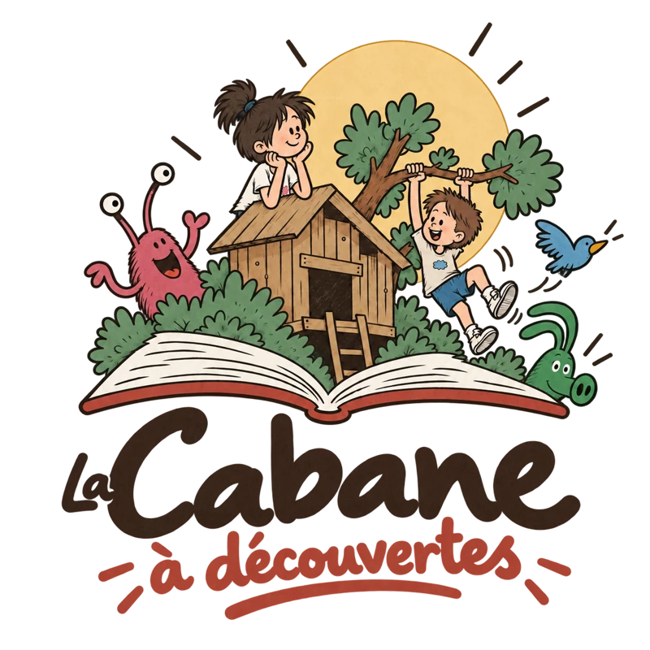

# Jeremy Somsouk

This repository publishes my public site and the interactive **Cabane à découvertes** prototype collection.

- Live site: <https://www.somsouk.fr/>
- Cabane: <https://www.somsouk.fr/cabane/>



## Contents

The site is split into two parts:

- `docs/` is the GitHub Pages site.
- `games/` contains the Rust engine compiled to WebAssembly.
- `scripts/` contains build and test scripts.

### La cabane à découvertes

Cabane is a small set of browser activities for reading and play:

- **La Fluence** reads a text aloud with a timer and simple reading controls.
- **Le Memory** plays a matching game with illustrated cards.
- **Le Chemin** asks you to connect every square on a grid without crossing your path.
- **Les Petits Calculs** asks you to write arithmetic answers by hand.
- **La Lumière** uses mirrors and prisms to wake sleeping ghosts.
- **La Rivière** offers 20 turn-based levels where channels guide water to plants.

All activities are static files and run without a server or third-party dependencies.

## Preview locally

Run a local static server:

```sh
python3 -m http.server 8765 --directory docs
```

Open `http://localhost:8765/cabane/`.

## Build

Cabane’s Memory and Rivière engines use Rust and WebAssembly. To build them:

```sh
rustup toolchain install 1.96.0 --profile minimal
rustup target add wasm32-unknown-unknown --toolchain 1.96.0
bash scripts/build-games.sh
```

## Checks

Run the test suites:

```sh
rustup run 1.96.0 cargo test --manifest-path games/memory/Cargo.toml
rustup run 1.96.0 cargo test --manifest-path games/river/Cargo.toml
rustup run 1.96.0 cargo clippy --manifest-path games/memory/Cargo.toml --all-targets -- -D warnings
rustup run 1.96.0 cargo clippy --manifest-path games/river/Cargo.toml --all-targets -- -D warnings
node --test scripts/*.test.mjs
```

## Structure

- `docs/`: Jekyll and static site files
- `games/memory/`: Rust source for the Memory engine
- `games/river/`: Rust source for the Rivière engine
- `scripts/`: Build and test helpers
- `docs/cabane/`: Cabane activity pages and assets
- `docs/cabane/images/`: Illustrations used by the activities
