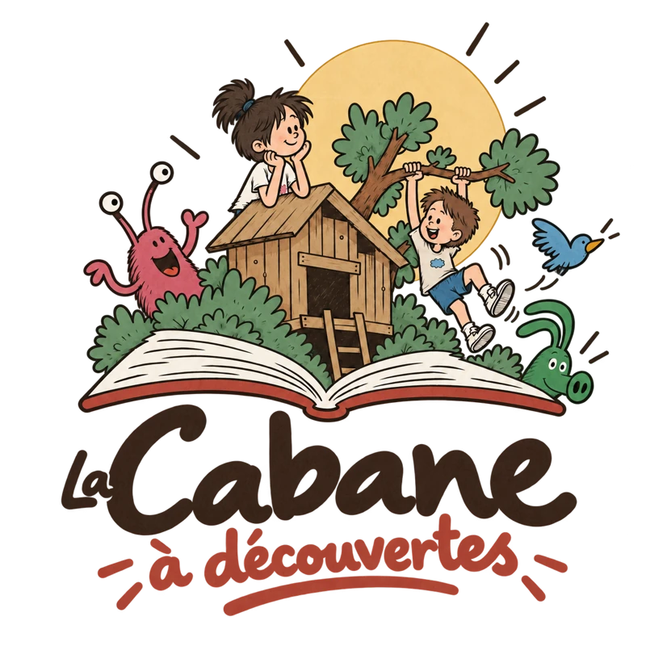

# Jeremy Somsouk

This repository publishes my public site and the interactive **Cabane à découvertes** prototype collection.

- Live site: <https://www.somsouk.fr/>
- Cabane: <https://www.somsouk.fr/cabane/>



## Contents

The site is split into two parts:

- `docs/` is the GitHub Pages site.
- `games/` contains the Rust engine compiled to WebAssembly.
- `scripts/` contains build and test scripts.

### La cabane à découvertes

Cabane is a small set of browser activities for reading and play:

- **La Fluence** reads a text aloud with a timer and simple reading controls.
- **Le Memory** plays a matching game with illustrated cards.
- **Le Chemin** asks you to connect every square on a grid without crossing your path.
- **Les Petits Calculs** asks you to write arithmetic answers by hand.
- **La Lumière** uses mirrors and prisms to wake sleeping ghosts.
- **La Rivière** offers thirty touch-first landscapes: scratch soft earth to release water and make ponds bloom. Levels 20 to 30 introduce paired underground passages across disconnected riverbanks, followed by branching routes and sluices.

All activities are static files and run without a server or third-party dependencies.

## Preview locally

Run a local static server:

```sh
python3 -m http.server 8765 --directory docs
```

Open `http://localhost:8765/cabane/`.

## Build

Cabane’s Memory engine uses Rust and WebAssembly. To build it:

```sh
rustup toolchain install 1.96.0 --profile minimal
rustup target add wasm32-unknown-unknown --toolchain 1.96.0
bash scripts/build-games.sh
```

## Checks

Run the test suites:

```sh
rustup run 1.96.0 cargo test --manifest-path games/memory/Cargo.toml
rustup run 1.96.0 cargo clippy --manifest-path games/memory/Cargo.toml --all-targets -- -D warnings
node --test scripts/*.test.mjs
```

## Structure

- `docs/`: Jekyll and static site files
- `games/memory/`: Rust source for the Memory engine
- `scripts/`: Build and test helpers
- `docs/cabane/`: Cabane activity pages and assets
- `docs/cabane/images/`: Illustrations used by the activities

## Leptos migration preview

The existing Jekyll site remains the production source. The new Rust workspace
generates a static homepage candidate, a shared-layout proof and an unchanged copy
of Cabane. This migration preview is not deployed.

Install Rust through rustup, then run from the repository root (the checked-in
`rust-toolchain.toml` selects Rust 1.96.0, rustfmt and Clippy):

```sh
rm -rf target/site-preview # Only the disposable generated preview
cargo run --locked --release -p site
python3 -m http.server 8766 --directory target/site-preview
```

Open `http://localhost:8766/` for the homepage or `/leptos-proof/` for the fixture.
Both contain complete HTML with local CSS and no executable JavaScript, Wasm or
hydration. The homepage includes non-executable JSON-LD metadata. `/cabane/` retains its existing JS/Wasm runtime.
The generator writes only to `target/site-preview/`, regardless of the working
directory, and never changes production sources. It refuses an existing preview
directory: remove the disposable preview before rebuilding, including after a
failed write. The manifest is validated before any output is written.

Only `docs/cabane/` runtime extensions (HTML, CSS, JS/MJS, JSON, Wasm, PNG, SVG,
WebP and ICO) are copied, byte for byte. Markdown is excluded; unknown extensions,
symlinks, unsafe paths and duplicate/file-directory destinations fail the build.
Four explicitly registered homepage assets from `docs/images/` are also copied
byte for byte. Jekyll configuration, authoring Markdown and migration notes are
never copied. The staged root now renders the homepage; existing absolute links
to the public domain still lead to production.

Workspace checks:

```sh
cargo fmt --check
cargo check --locked
cargo clippy --locked --all-targets --all-features -- -D warnings
cargo test --locked
python3 scripts/verify-site-preview.py # After generating the preview
```

`crates/content` contains plain Rust content types; `crates/site` renders them with
Leptos and provides the native generator. Memory remains an independent Cargo
project with its own lockfile/profile and existing build commands.

Read [migration TODO](docs/todo.md), [progress](docs/progress.md) and
[architecture](docs/architecture.md) before continuing. The `Leptos preview` workflow runs on every branch push and pull request, and
supports manual dispatch once available on the default branch. It uses the pinned
Rust toolchain, runs the workspace checks and release generator, then validates
the exact artifact file set, unchanged Cabane bytes, static proof, page routes and
local HTML resource URLs. Successful runs upload `leptos-preview` for seven days.
The artifact is downloadable from the workflow run; it is not a hosted deployment.
The existing Cabane/Jekyll workflow remains independent and unchanged.

There are deliberately no path filters during migration, so new build inputs
cannot silently miss validation. Push and PR runs may both occur; newer runs of
the same event/ref cancel older ones. The workflow has read-only repository
permissions and does not request Pages or deployment access.

The shared layout lives in `crates/site/src/ui.rs`; site-only tokens and responsive
rules live in `styles/site.css`. The proof uses example content; `crates/site/src/homepage.rs` composes the real
homepage from the typed records and trusted Markdown. Cabane continues to use its own styles and controllers.
Inter variable fonts and four Tabler SVG navigation icons are self-hosted from
`public/`, with licenses in `public/licenses/`. Navigation retains accessible
labels; ordinary pages require no JavaScript. Desktop/mobile/print comparison
remains a release requirement; this candidate is
not visually approved for cutover.

The preview includes `/404.html`. The homepage, proof and error page share
`site::document::render_document` and typed `site_content::PageMetadata`. Unknown
paths must be served with HTTP 404 by the eventual host; `python3 -m http.server`
lets you inspect `/404.html` directly but does not use it as a custom fallback.
The verifier separately simulates missing-path responses and checks their status,
body, root-relative resources, indexing policy and recovery links.


Project presentations are generated at `/projects/`, `/projects/cabane/` and
`/projects/melimo/`. The project list and detail pages reuse homepage metadata and
shared UI; application/repository links retain their existing destinations. Add a
project record to `HOMEPAGE.projects` with a unique safe slug and register any new
image in the static asset manifest. Its presentation route is generated automatically;
update the verifier’s expected route inventory when adding a project.

### Writing articles on GitHub

Article loading is implemented; blog page rendering and production publication are
still migration tasks. To prepare a post, use GitHub's **Add file → Create new
file** (or upload) at `content/blog/my-first-post.md`:

```markdown
+++
title = "My first post"
description = "A short description for listings and search results."
slug = "my-first-post"
date = 2026-09-28
draft = true
tags = ["Rust"]
+++
Write the article in Markdown here.
```

The filename must match `slug`. Use lowercase ASCII letters/numbers separated by
single hyphens, at most 80 characters. `title`, `description`, `slug` and an
unquoted `YYYY-MM-DD` date are required. `tags` is optional; omitted `draft`
defaults to true. Set `draft = false` to opt into publication. The publishing
selection also excludes dates after its explicit build date; rebuilding on/after
that date is required, so this is not an automatic scheduling service.

An optional `[image]` table at the end of the front matter accepts `src` (a
site-root asset path) and nonblank `alt`. Image existence and publication must
also be handled by the asset pipeline; declaring an image does not upload it.
Keep assets outside `content/blog/`, which accepts flat `.md` files only.

CI validates all files, including drafts: invalid dates, unknown metadata fields,
empty content, duplicate/unsafe slugs, symlinks and filename mismatches fail with
source-path context. Markdown is trusted repository-authored content; raw HTML
is preserved, not sanitized. Drafts are excluded from generated pages, **not
hidden in this public GitHub repository**—do not commit private drafts or secrets.
